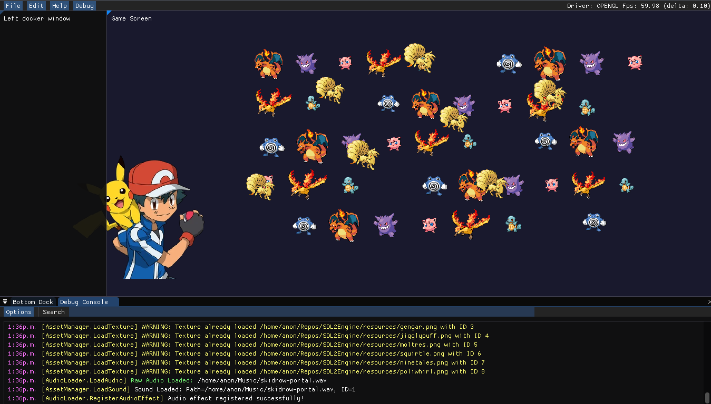

# SDL2Engine

SDL2Engine is a robust rendering engine built using C# that leverages the power of SDL2 and ImGui for rendering and GUI functionality. 

- Game Template Example: https://github.com/EZroot/SDL2Game

## Features

- **SDL2 for low-level window management and 2D rendering**
- **ImGui.NET for an immediate mode GUI, with custom C# wrappers (ImGuiNative since it isn't officially supported) for additional flexibility**
- **Cross-platform capabilities courtesy of SDL2 and ImGui <3**

## Prerequisites

Before you can build and run SDL2Engine, you need to have the following tools installed on your system:

- Git
- CMake
- .NET SDK (compatible with your version of SDL2Engine)

## Getting Started

To set up SDL2Engine on your local machine, follow these steps:

### Lib Prerequisites
- `SDL2_Image.so`
- `SDL2_mixer.so`
- `cimgui.so`
- `SDL2-CS.dll`

For help on how to build each dll/library check the /docs
- [Building Dll/Lib's Tutorial](docs/DLLCMAKEHELP.md)

### Configure Your Project

- Ensure that all libraries are correctly placed in the `/libs` directory of your project.
- Configure your .NET project to reference these libraries.

### Building SDL2Engine

Once all dependencies are configured, you can build SDL2Engine by navigating to the root directory of the project and running:

`dotnet build`

## Documentation

For more detailed documentation on how to use SDL2Engine and extend its capabilities, refer to the `/docs` folder in this repository.

Or grab a game example:
- Game Template Example: 
- - https://github.com/EZroot/SDL2Game
- Reference SDL2Engine and run!

`git clone https://github.com/EZroot/SDL2Game.git`

`cd SDL2Game`

`dotnet run`

## Contributing

Contributions to SDL2Engine are welcomed & encouraged!

## License

This project is licensed under the 'DO WHATEVER YOU WANT' License.

## Acknowledgments

- Thanks to the gods of SDL2 and ImGui for their fantastic libraries <3
