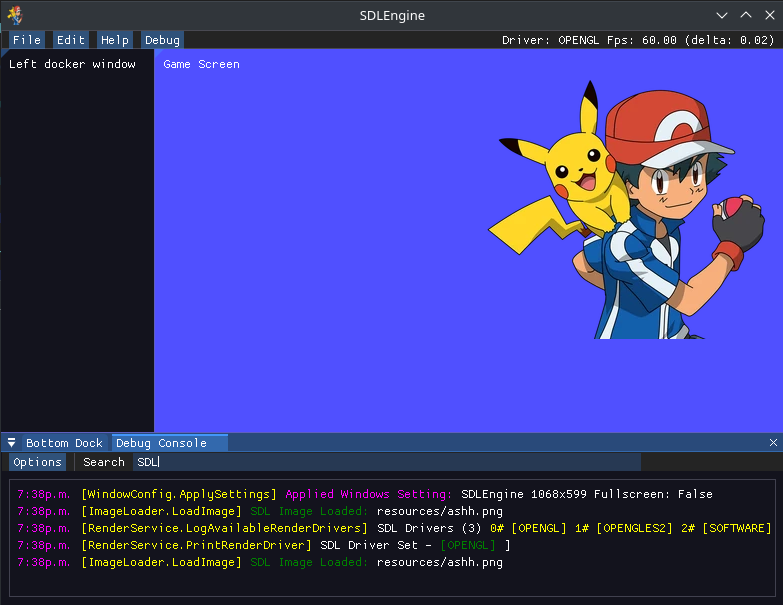

# SDL2Engine

SDL2Engine is a robust rendering engine built using C# that leverages the power of SDL2 and ImGui for rendering and GUI functionality. It includes a custom C# wrapper for IMGui native DLL calls, providing smooth integration not automatically available through ImGui.NET automatic unwrapping. Super annoying. >:(

## Features

- **SDL2 for low-level window management and 2D rendering**
- **ImGui.NET for an immediate mode GUI, with custom C# wrappers (ImGuiNative since it isn't officially supported) for additional flexibility**
- **Cross-platform capabilities courtesy of SDL2-CS and Cimgui <3**

## Prerequisites

Before you can build and run SDL2Engine, you need to have the following tools installed on your system:

- Git
- CMake
- .NET SDK (compatible with your version of SDL2Engine)

## Getting Started

To set up SDL2Engine on your local machine, follow these steps:

### Clone the Repositories

1. **CImGui:**

git clone --recursive https://github.com/cimgui/cimgui.git 
cd cimgui 
cmake ..

Build the project according to your platform's requirements
Copy the resulting lib.so or equivalent library file to your project's /libs folder

2. **SDL2-CS:**

git clone https://github.com/flibitijibibo/SDL2-CS.git 
cd SDL2-CS 
dotnet build

Copy the output files to your project's /libs folder

### Configure Your Project

- Ensure that all native libraries (from CImGui and SDL2-CS) are correctly placed in the `/libs` directory of your project.
- Configure your .NET project to reference these libraries.

### Run SDL2Engine

Once all dependencies are configured, you can run SDL2Engine by navigating to the root directory of the project and running:

dotnet run

## Documentation

~~For more detailed documentation on how to use SDL2Engine and extend its capabilities, refer to the `/docs` folder in this repository.~~

Check the interwebs or ask Chat Gippity.

## Contributing

Contributions to SDL2Engine are welcomed & encouraged!

## License

This project is licensed under the 'DO WHATEVER YOU WANT I DONT CARE' License.

## Acknowledgments

- Thanks to the gods of SDL2 and ImGui for their fantastic libraries <3