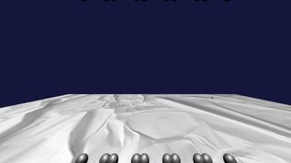

# SDL2Engine

An advanced SDL2 / OpenGL engine implemented in C#, designed for creating high-performance 2D and 3D games and applications.

## Features
- **Window and Input Management**: Utilizes SDL for handling window operations and input events.
- **Rendering Support**: Offers both 2D rendering via SDL and 2D/3D rendering through OpenGL.
- **Advanced Graphics**: Implements 3D lighting and shadow effects, along with special effects like post processing and world space godrays.
- **Physics Engines**: Integrates Box2D for 2D physics and BepuPhysics-v2 for 3D physics simulations.
- **Networking**: Basic networking capabilities for multiplayer game support.

## Library Prerequisites
Ensure the following libraries are correctly placed in the `/libs` directory of your project, and configure your .NET project to reference them:
- `SDL2_image.so`
- `SDL2_mixer.so`
- `SDL2_ttf.so`
- `cimgui.so`
- `SDL2-CS.dll`

For guidance on building each DLL/library, refer to the [Building DLLs / Libraries Tutorial](docs/DLLCMAKEHELP.md).

## Showcase and Examples

### OpenGL 3D Renderer
Explore advanced 3D rendering features like shadows, godrays, and physics simulations with Bepu3D in:
- [TreeDee Repository](https://github.com/EZroot/TreeDee).

### SDL 2D Renderer
Discover the capabilities of the SDL 2D renderer combined with GUI elements and Box2D physics in:
- [SDL2Game Repository](https://github.com/EZroot/SDL2Game)

### Music Player Example
Check out the Music Player demonstrating audio playback integration in:
- [MusicPlayer Repository](https://github.com/EZroot/MusicPlayer).

