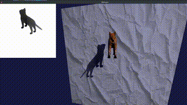
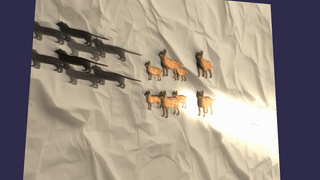
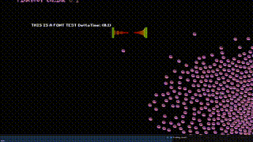
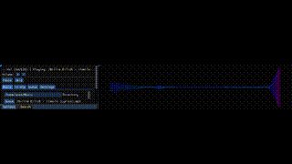

# SDL2Engine

A SDL2 / OpenGL engine built using C#.

### Features
- SDL Window / Input handling
- 2D / 3D Rendering (SDL Renderer: 2D OpenGL: 2D/3D)
- 3D Lighting
- Box2D Physics
- Basic Networking support
### Lib Prerequisites
- `SDL2_image.so`
- `SDL2_mixer.so`
- `SDL2_ttf.so`
- `cimgui.so`
- `SDL2-CS.dll`

Ensure that all libraries are correctly placed in the `/libs` directory of your project.
Configure your .NET project to reference these libraries.

For help on how to build each dll/library check the /docs
- [Building Dll / Lib's Tutorial](docs/DLLCMAKEHELP.md)

## Template Examples (Compressed Gifs)

### OpenGL 3D  Renderer + Shadows
- Repository: https://github.com/EZroot/TreeDee

### SDL Renderer Game / Gui Example
- Repository: https://github.com/EZroot/SDL2Game

### Music Player Example
- Repository: https://github.com/EZroot/MusicPlayer

