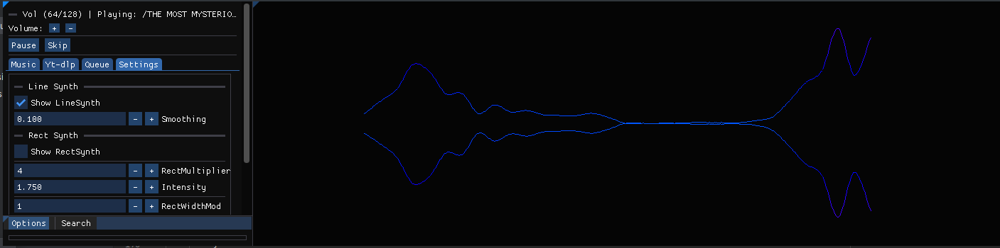

# SDL2Engine

SDL2Engine is a robust rendering engine built using C# that leverages the power of SDL2 and ImGui for rendering and GUI functionality. 

## Features

- **SDL2 for low-level window management and 2D rendering**
- **ImGui.NET for an immediate mode GUI, with custom C# wrappers (ImGuiNative since it isn't officially supported) for additional flexibility**
- **Box2D for 2d physics**
- **Basic Network Capabilities**
- **Cross-platform capabilities courtesy of SDL2 and ImGui <3**

## Getting Started

To set up SDL2Engine on your local machine, follow these steps:

### Lib Prerequisites
- `SDL2_Image.so`
- `SDL2_mixer.so`
- `cimgui.so`
- `SDL2-CS.dll`

For help on how to build each dll/library check the /docs
- [Building Dll/Lib's Tutorial](docs/DLLCMAKEHELP.md)

### Configure Your Project

- Ensure that all libraries are correctly placed in the `/libs` directory of your project.
- Configure your .NET project to reference these libraries.

## Templates

### Game
- Repository: https://github.com/EZroot/SDL2Game

  

### Music Player
- Repository: https://github.com/EZroot/MusicPlayer

  
  

